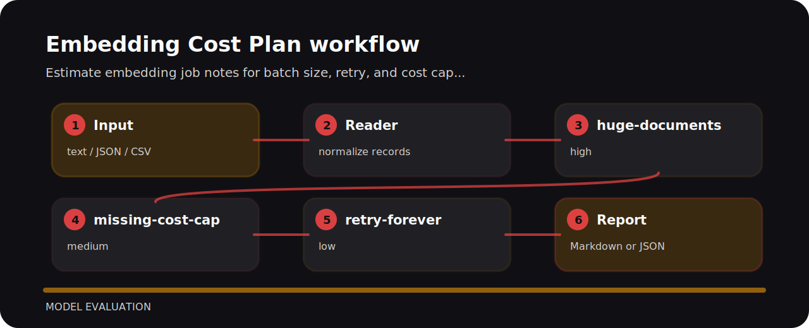

# Embedding Cost Plan


Estimate embedding job notes for batch size, retry, and cost cap gaps. The command is intentionally direct so it can sit in a local review, a CI step, or a one-off audit.

## Policy flow



## Decision points

| Signal | Level | What it flags | Fix direction |
| --- | --- | --- | --- |
| `huge-documents` | high | large embedding job detected | estimate cost before run |
| `missing-cost-cap` | medium | cost cap missing | set budget limit |
| `retry-forever` | low | retry is unbounded | use bounded retries |

## Local check

```bash
git clone https://github.com/mertefekurt/embedding-cost-plan.git
cd embedding-cost-plan
python -m pip install -e ".[dev]"
embedding-cost-plan examples/sample.txt
```

## Before the fix

```text
risky: documents 5000000 batch_size unknown cost_cap none retry forever
clean: documents 50000 batch_size 100 cost_cap 200 retry 3
```
